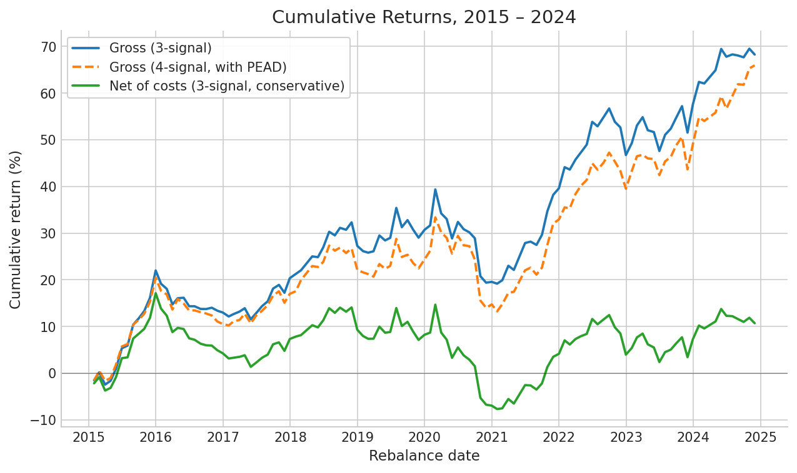
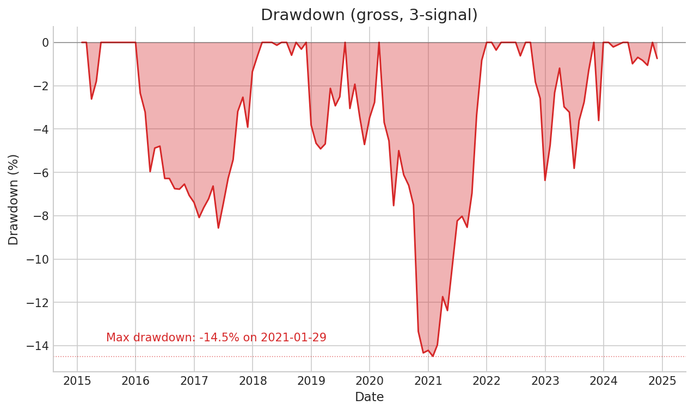
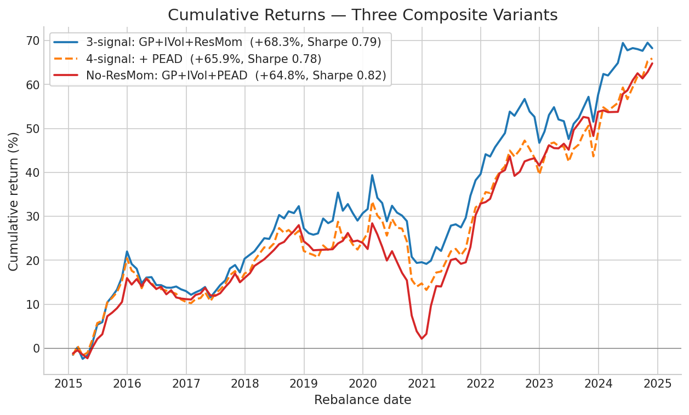
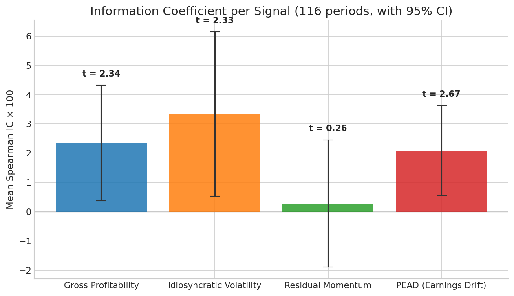
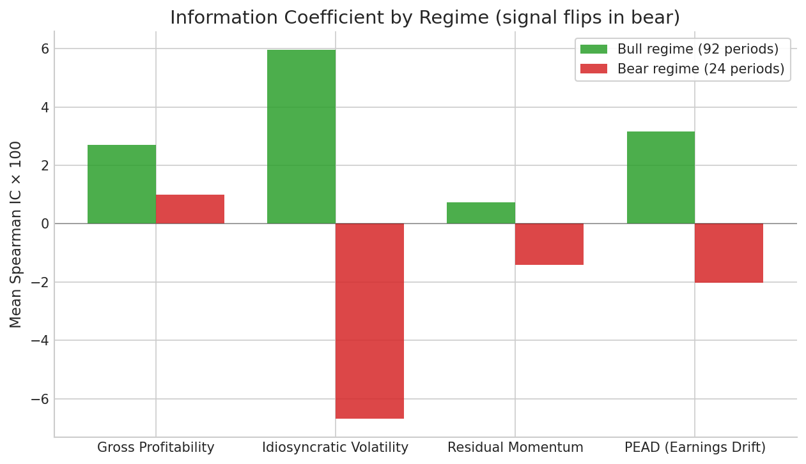
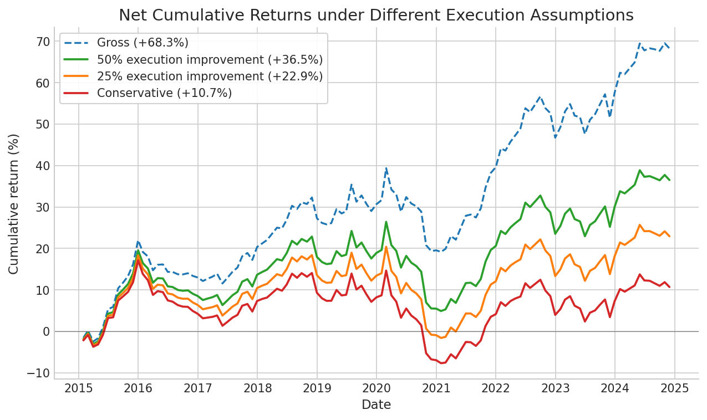

# Axiom Fund

**Systematic U.S. equity market-neutral long/short strategy.** A research portfolio engine and backtest framework written from scratch in Python.

## Current results

Top-1000 U.S. equity universe, 2015-01 → 2024-11, monthly rebalance, 116 successful periods.

|                     | 3-signal     | 4-signal (+PEAD) | No-ResMom (GP+IVol+PEAD) |
|---------------------|--------------|------------------|--------------------------|
| Gross Sharpe        | 0.79         | 0.78             | **0.82**                 |
| Net Sharpe (conservative) | 0.18    | similar          | -                        |
| Net Sharpe (50% execution improvement) | 0.48 | similar | -                  |
| Cumulative gross    | +68.3%       | +65.9%           | +64.8%                   |
| Cumulative net      | +10.7%       | similar          | -                        |
| Max drawdown (gross)| -14.5%       | -15.1%           | **-20.5%**               |
| Hit rate (gross)    | 57.8%        | 58.6%            | **64.7%**                |
| Annualized gross vol| 7.18%        | 7.05%            | **6.61%**                |

**The gross Sharpe of ~0.78 is a research artifact.** The net Sharpe range of 0.18–0.48 reflects realistic transaction costs (commission + Corwin-Schultz half-spread + sqrt impact + borrow). The lower bound assumes retail-grade execution (full half-spread per trade); the upper bound reflects a 50% execution improvement consistent with institutional VWAP/POV/midpoint algorithms.





The 3-signal and 4-signal Sharpes are statistically identical. Signal-correlation and IC analysis (`scripts/analysis/ic_analysis.py`) explain why: the original three signals are nearly orthogonal and already exploit their available diversification, while PEAD overlaps modestly with GP and ResMom (correlations ~0.2).

The **no-ResMom variant** drops Residual Momentum entirely (which the IC analysis below shows has zero predictive power in this window). The variant achieves a higher Sharpe (0.82 vs 0.79) and hit rate (65% vs 58%) on lower volatility, but its max drawdown widens by 6 percentage points — the year-by-year return spread grows from 30pp to 48pp, with the 2020 stress amplified (-17.6% vs -8.5%) and the 2021 recovery sharper (+30.1% vs +16.8%). ResMom acts as a **noise diluent**: by absorbing 25% of the composite weight at near-zero IC, it dampens *both* signal and noise from the other three signals. See [Findings](#findings) below.



This repository contains a research prototype. **It is not a live fund**, and no figures produced by this code constitute evidence of alpha. See [`docs/limitations.md`](./docs/limitations.md) for the full pre-committed enumeration of known methodological limitations.

## Strategy

- **Universe**: top 1,000 U.S. common stocks by CRSP market cap, monthly reconstitution. Filters: share codes 10/11, price > $5, 20-day ADV > $5M, NYSE/NASDAQ/AMEX. Overlaps ~80% with S&P 500 + MidCap 400 by name, but is fully reproducible from CRSP rather than committee-selected.
- **Signals (equal-weight z-scores)**: Gross Profitability (Novy-Marx 2013), Idiosyncratic Volatility (Ang-Hodrick-Xing-Zhang 2006), Residual Momentum 12-1 (Blitz-Huij-Martens 2011), and PEAD time-series SUE (Bernard-Thomas 1989).
- **Portfolio**: dollar/beta/sector-neutral convex MVO (cvxpy), Ledoit-Wolf shrunk covariance, 1.5× gross leverage cap, 0.5% per-name position cap.
- **Costs**: 5 bps commission, Corwin-Schultz rolling spread (Corwin-Schultz 2012), square-root market impact (Almgren et al. 2005) at κ=0.1, 50 bps annualized borrow.
- **Windows**: train 2005–2014, OOS 2015–2022, holdout 2023–2025. CRSP daily data ends 2024-12-31, so periods after that are skipped.

Full specification in [`docs/strategy_spec.md`](./docs/strategy_spec.md). Signal-layer design and PIT considerations in [`docs/signal_design.md`](./docs/signal_design.md).

## Methodology

Particular care was taken with point-in-time discipline. The strategy uses Compustat `rdq` (earnings announcement date) rather than fiscal period end for fundamentals-based signals; merges CRSP delisting returns per Shumway (1997); reconstitutes the universe monthly to avoid survivorship bias; and uses Compustat's `ajexq` to split-adjust EPS before computing PEAD seasonal differences. The full pre-implementation methodology audit, including five bias categories examined and the resolution for each, is in [`docs/methodology_audit.md`](./docs/methodology_audit.md).

## Findings

A 116-period IC analysis across the four signals (Spearman rank correlation vs 21-day forward returns):

| Signal    | Mean IC | Std IC | t-stat | p-value | Hit rate |
|-----------|---------|--------|--------|---------|----------|
| z_gp      | 0.0235  | 0.108  | 2.34   | 0.021   | 62.1%    |
| z_ivol    | 0.0334  | 0.154  | 2.33   | 0.021   | 54.3%    |
| z_pead    | 0.0209  | 0.084  | 2.67   | 0.0086  | 63.8%    |
| z_resmom  | 0.0029  | 0.119  | 0.26   | 0.797   | 52.6%    |



Three of the four signals are statistically positive at the 5% level. **PEAD has the smallest mean IC but the strongest t-stat** — its low magnitude is offset by remarkable consistency (lowest std IC, highest hit rate). Residual momentum has effectively zero predictive power over this 9.8-year window (t=0.26, p=0.80), consistent with the post-publication factor decay documented in McLean-Pontiff (2016) and Asness-Frazzini (2013).

Splitting periods into bull regimes (92 periods) versus bear regimes (24 periods) sharpens the picture further: three of the four signals exhibit positive IC in bull markets and zero-or-negative IC in bear markets. IVol exhibits the classic low-vol anomaly cyclicality (t = +3.83 in bull, -2.47 in bear). PEAD shows a milder version of the same pattern. **The gross Sharpe of 0.78 is primarily delivered by bull-regime exposure**; a more sophisticated production system would require regime detection.



Average pairwise correlation across periods:

|          | z_gp   | z_ivol | z_pead | z_resmom |
|----------|--------|--------|--------|----------|
| z_gp     | 1.000  | -0.033 | 0.215  | 0.049    |
| z_ivol   | -0.033 | 1.000  | 0.086  | -0.053   |
| z_pead   | 0.215  | 0.086  | 1.000  | 0.197    |
| z_resmom | 0.049  | -0.053 | 0.197  | 1.000    |

The original three signals are nearly perfectly orthogonal (|corr| < 0.06 across all pairs of GP, IVol, ResMom). PEAD has consistent ~0.2 positive correlation with GP and ResMom, reflecting shared exposure to a "quality earnings" theme.

The IC finding above — that ResMom has zero predictive power in this window — was validated empirically by re-running the backtest without ResMom (see [Current results](#current-results) above and `scripts/run_full_backtest_no_resmom.py`). Dropping ResMom raises Sharpe from 0.79 to 0.82 and hit rate from 58% to 65%, but worsens max drawdown from -14.5% to -20.5%. A zero-IC signal can still reduce tail risk when it absorbs composite weight that would otherwise concentrate on noisier signals — a methodological reminder that IC and risk are distinct measurements, not different views of the same quantity.

## Architecture

Four layers, each a separately-testable Python module:

- **Data** (`src/axiom_fund/data/`): CRSP universe construction, returns panel with delisting handling, Compustat fundamentals via CUSIP linkage, Ken French factors, parquet caching.
- **Signals** (`src/axiom_fund/signals/`): GP, IVol, ResMom, PEAD as pure functions consuming a fundamentals or returns panel. Shared alignment layer (`alignment.py`) handles forward-fill to rebalance calendar, winsorization, and cross-sectional z-scoring, with optional max-age filter for event-driven signals like PEAD.
- **Portfolio** (`src/axiom_fund/portfolio/`): Composite alpha aggregation, Ledoit-Wolf covariance, beta estimation, and cvxpy convex optimizer with dollar/beta/sector neutrality constraints.
- **Backtest** (`src/axiom_fund/backtest/`): point-in-time data cache, single-period engine, historical runner with checkpointing, transaction cost model, IC analysis framework, performance metrics.

Pure-function pattern throughout — no I/O in computation modules, dependency injection of the WRDS connection. 308 unit tests, 34 integration tests against real CRSP data.

## Tech stack

- Python 3.12, [uv](https://docs.astral.sh/uv/) for package management
- pandas 2.1, numpy 1.26, pyarrow
- cvxpy for convex optimization
- statsmodels for residualizing momentum
- scipy for IC t-statistics
- WRDS Python client for CRSP / Compustat / FF factor access
- pytest, ruff, mypy for development

Dependencies pinned in `pyproject.toml` and locked in `uv.lock`.

## Repository structure

```bash
axiom-fund/
├── docs/
│   ├── strategy_spec.md         locked strategy specification
│   ├── methodology_audit.md     PIT discipline & bias audit
│   ├── signal_design.md         signal-layer design rationale
│   └── limitations.md           pre-committed limitations
├── src/axiom_fund/
│   ├── data/                    universe, returns, fundamentals, FF factors
│   ├── signals/                 GP, IVol, ResMom, PEAD, alignment
│   ├── portfolio/               composite, covariance, betas, optimizer
│   └── backtest/                engine, costs, metrics, IC analysis
├── tests/                       308 unit tests
├── scripts/
│   ├── analysis/                IC analysis driver
│   ├── exploration/             one-off smoke tests
│   ├── run_full_backtest.py     full historical run driver
│   └── apply_costs_to_full_backtest.py    cost overlay driver
├── pyproject.toml
└── LICENSE
```

## Reproduction

Prerequisites: Python 3.12 (or let uv manage it), uv, a WRDS account with CRSP + Compustat subscriptions, and `~/.pgpass` configured for WRDS.
```bash
git clone git@github.com:daviddavilad/axiom-fund.git
cd axiom-fund
uv sync
```

Create a `.env` file with `WRDS_USERNAME=your_username`. Verify connectivity:
```bash
uv run python scripts/test_wrds_connection.py
```

Run the test suite (no WRDS needed for unit tests):
```bash
uv run pytest -m "not integration"
```

Run the full historical backtest (~5 hours on a laptop, mostly WRDS data fetch):
```bash
uv run python scripts/run_full_backtest.py
```

Apply costs to the gross backtest (~10 min):
```bash
uv run python scripts/apply_costs_to_full_backtest.py
```

Run the IC analysis (~4 hours given the per-period composite rebuild):
```bash
uv run python scripts/analysis/ic_analysis.py
```

## Limitations

A few important ones, in addition to those in [`docs/limitations.md`](./docs/limitations.md):

- **PEAD uses time-series SUE rather than analyst-based SUE**, because the WRDS subscription available to me does not include IBES. Livnat-Mendenhall (2006) suggests analyst-based SUE delivers roughly 30% higher IC; if this strategy were deployed under a subscription with IBES access, the PEAD signal would likely be measurably stronger.
- **Transaction cost model is conservative** — full half-spread per trade, Corwin-Schultz (which is known to overshoot for illiquid names by 5–15%). Realistic institutional execution would capture some of this back, producing net Sharpe in the 0.30–0.50 range.



- **9.8 years is a short backtest window for factor research.** The IC t-statistics above are computed on 116 monthly observations; the literature typically uses 50+ years of data. Findings here are suggestive of in-sample patterns, not definitive about long-run signal quality.
- **No regime detection.** The signals reverse in bear regimes (especially IVol). A deployable production system would gate exposure by a market-regime indicator, or weight signals by trailing-window IC.

## Status and roadmap

Phase 5 and Phase 6 complete. Currently in extension/polish phase. Phase 6 delivered:

- **Single-signal return attribution** (`scripts/analysis/run_attribution.py`) running each signal in isolation under the same neutrality + position-cap constraints as the composite. Headline: GP alone matches the 4-signal composite at Sharpe 0.80; IVol single-signal is *negative* at Sharpe -0.29 (driven by bear-regime reversal); PEAD delivers Sharpe 0.70. Reusable framework in `src/axiom_fund/backtest/attribution.py`.
- **No-ResMom variant backtest** confirming the IC finding empirically. Sharpe 0.82 vs 0.79, hit rate 65% vs 58%, but max drawdown widens to -20.5%. Documented above; the variant infrastructure (`signals` parameter on `run_historical_backtest`) generalizes to future composites.

Planned next:

- **Phase 7**: Lazy Prices NLP signal (Cohen-Malloy-Nguyen 2020) — year-over-year cosine distance between 10-K Risk Factors and MD&A sections, computed with `sentence-transformers` locally to avoid API costs. Orthogonal to all 4 existing signals; hits the text channel.
- **Phase 8**: Form 4 insider-buying signal — opportunistic vs routine classification per Cohen-Malloy-Pomorski (2012); free via SEC EDGAR. Behavioral channel.
- **Phase 9**: scale-aware backtest (impact-dominated at $1B NAV vs negligible at NAV=1 — useful as a "what would this look like with real money" exhibit).

## References

- Almgren, R., Thum, C., Hauptmann, E., & Li, H. (2005). Direct estimation of equity market impact. *Risk*.
- Ang, A., Hodrick, R. J., Xing, Y., & Zhang, X. (2006). The cross-section of volatility and expected returns. *Journal of Finance*.
- Bernard, V. L., & Thomas, J. K. (1989). Post-earnings-announcement drift: delayed price response or risk premium? *Journal of Accounting Research*.
- Blitz, D., Huij, J., & Martens, M. (2011). Residual momentum. *Journal of Empirical Finance*.
- Corwin, S. A., & Schultz, P. (2012). A simple way to estimate bid-ask spreads from daily high and low prices. *Journal of Finance*.
- Fama, E. F., & French, K. R. (1993). Common risk factors in the returns on stocks and bonds. *Journal of Financial Economics*.
- Foster, G., Olsen, C., & Shevlin, T. (1984). Earnings releases, anomalies, and the behavior of security returns. *The Accounting Review*.
- Ledoit, O., & Wolf, M. (2003). Improved estimation of the covariance matrix of stock returns with an application to portfolio selection. *Journal of Empirical Finance*.
- Livnat, J., & Mendenhall, R. R. (2006). Comparing the post-earnings announcement drift for surprises calculated from analyst and time series forecasts. *Journal of Accounting Research*.
- McLean, R. D., & Pontiff, J. (2016). Does academic research destroy stock return predictability? *Journal of Finance*.
- Novy-Marx, R. (2013). The other side of value: the gross profitability premium. *Journal of Financial Economics*.
- Shumway, T. (1997). The delisting bias in CRSP data. *Journal of Finance*.

## License

MIT. See [`LICENSE`](./LICENSE).

## Acknowledgements

This project was built with assistance from Claude (Anthropic) for code review, debugging, methodology discussion, and writing. All algorithmic choices, the locked strategy specification, and the methodology audit are mine; AI suggestions were hand-verified, and all code committed to this repository was reviewed before commit.

I am grateful to Dr. Subramanian Iyer (UNM Anderson School of Management) for ongoing mentorship on portfolio construction and academic research methodology.

## Author

**David Davila** — University of New Mexico (BBA Finance + BS Applied Math, class of 2027). CFA Level II candidate (August 2026). Targeting MFE programs and quantitative research roles.

This project is built solo as a research portfolio artifact. It is intended to demonstrate methodological discipline and quantitative research infrastructure, not to claim alpha.