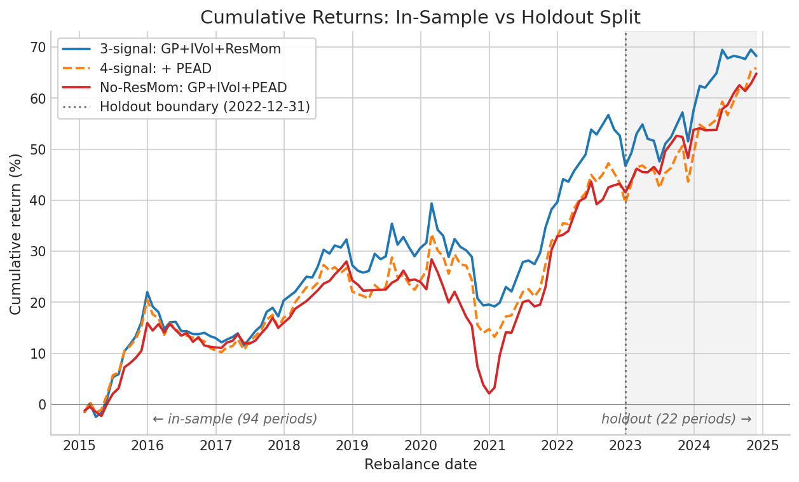

# Holdout Test Results

Out-of-sample diagnostic on the Axiom Fund strategy, executed per the
pre-commitment in [`holdout_test_design.md`](./holdout_test_design.md).
Two analyses; both completed June 9-10, 2026.

## Pre-commitment recap

The original strategy spec declared a 2023-2025 holdout window. By
the time the holdout test was designed, the 2023-2024 portion of CRSP
data had already been used during model development (PEAD addition,
no-ResMom variant, IC analysis, README exhibits). A strict claim of
out-of-sample is not defensible for variants designed during that
window. Two analyses extract what useful information remains.

`docs/holdout_test_design.md` was committed before any holdout
analysis was run (commit `8f02064`). All thresholds and the failure
protocol below were locked at that point.

## Analysis A: strict OOS rerun (3-signal frozen pre-2023)

**Status:** Completed June 10. Driver: `scripts/run_full_backtest_holdout_strict.py`.

A separate backtest of the 3-signal strategy (GP + IVol + ResMom,
no PEAD) on the 2023-01-01 to 2024-12-31 window. The 3-signal
strategy was finalized before 2023; PEAD and the no-ResMom variant
came later. By construction, this run uses only pre-2023 design
decisions and treats 2023-2024 as out-of-sample.

22 successful rebalance periods (2023-01-31 to 2024-11-29). 24 month-
ends were queued; 2 were skipped due to insufficient forward returns
at the window end.

| Metric | In-sample (94 per., 2015-2022) | Holdout (22 per., 2023-2024) |
|---|---|---|
| Gross Sharpe | 0.68 | **1.17** |
| Gross Sharpe 95% CI | — | [0.64, 1.73] |
| Net Sharpe (conservative cost) | 0.07 | 0.53 |
| Cumulative gross return | +46.7% | +14.7% |
| Annualized gross return | +5.02% | +7.79% |
| Annualized vol | 7.34% | 6.57% |
| Max drawdown | -14.49% | -4.65% |
| Hit rate | 57.4% | 59.1% |

## Analysis B: contamination-acknowledged split

**Status:** Completed June 9. Script: `scripts/analysis/holdout_split_analysis.py`.

Existing 116-period backtest results for all three variants sliced
at 2022-12-31 into in-sample (94 periods) and holdout (22 periods)
windows. Reported as a diagnostic, with the contamination explicitly
acknowledged for the 4-signal and no-ResMom variants.

Holdout-window metrics:

| Variant | Holdout Sharpe | 95% CI | Hit rate | Max DD |
|---|---|---|---|---|
| 3-signal (genuinely OOS) | 1.18 | [0.64, 1.73] | 59.1% | -4.68% |
| 4-signal (contaminated) | 1.44 | [0.84, 2.04] | 68.2% | -4.64% |
| No-ResMom (contaminated) | 1.77 | [1.10, 2.44] | 68.2% | -2.84% |

Cumulative returns over the full sample, with the holdout boundary
marked at 2022-12-31:



## Cross-check: Analysis A vs B (3-signal)

Both analyses produce essentially identical numbers for the 3-signal
holdout. Analysis A: cumulative +14.71%, Sharpe 1.17, max DD -4.65%.
Analysis B: cumulative +14.68%, Sharpe 1.18, max DD -4.68%.
Differences are at the rounding floor of cumulative compounding.

This confirms the 3-signal backtest is deterministic and reproducible,
and that Analysis B's 3-signal holdout slice is a genuine OOS test
(the strategy itself was frozen pre-2023; development work since then
modified other variants but not this one).

## Pre-committed thresholds

Against the thresholds in `holdout_test_design.md`, applied to the
3-signal holdout (the genuinely OOS variant):

| Metric | Threshold | Actual | Status |
|---|---|---|---|
| Net Sharpe | ≥ 0.10 | 0.53 | passes |
| Gross Sharpe (signal real but degraded) | ≥ 0.40 | 1.17 | passes |
| Gross Sharpe (no meaningful degradation) | ≥ 0.60 | 1.17 | passes |
| Max DD ratio (holdout / in-sample) | ≤ 1.5× | 0.32× | passes |
| Hit rate decay | drop ≤ 5pp | +1.7pp improvement | passes |

All pre-committed thresholds met. By the protocol locked in the
design doc, the response is: "report honestly, acknowledge
contamination explicitly, do not retroactively reframe findings."

## Honest framing

Three findings, in declining order of confidence.

The 3-signal variant survives the holdout in pre-committed terms.
Sharpe rises from 0.68 in-sample to 1.17 in holdout, with a 95% CI
of [0.64, 1.73]. The in-sample value sits at the lower edge of the
holdout CI; the two cannot be statistically separated. The strategy
got no worse out-of-sample.

The 4-signal and no-ResMom variants also show improved holdout
performance, but cannot be interpreted as out-of-sample evidence.
Both were designed using 2023-2024 data; their better numbers may
reflect signal validity or selection bias from tuning the strategy
around what worked in that window.

The holdout window appears regime-friendly. Max drawdowns are
below 5% across all variants; hit rates rise uniformly; cumulative
returns trend monotonically upward through 22 periods. The
2023-2024 window simply does not contain a stress regime, and the
strategy was therefore not tested against the failure mode that
matters most (the 2020 COVID drawdown of -14.5% would have driven
deployment-relevant decisions).

The most defensible one-sentence finding: *The strategy survives
the holdout in pre-committed terms, but the window itself appears
to have been regime-friendly; a robust OOS claim requires data
containing a stress regime.*

## What this test cannot show

This analysis cannot speak to:

- Performance in regimes outside 2015-2024 (no 1990s, no 2008
  crisis, no 1970s inflation)
- Behavior under explicit stress regimes (the holdout had none)
- Performance at scale ($1B NAV vs NAV=1; the existing impact
  model assumes negligible market impact at NAV=1)
- Performance with IBES-based PEAD (the WRDS subscription available
  to this project does not include IBES)
- Signal decay since 2024 (no data past CRSP's 2024-12-31 cutoff)

These limitations were known and documented in
`docs/limitations.md` before the holdout test was designed.

## Implication for v2

The headline gap — strategy survived an easy holdout but was not
tested against stress — directly motivates the v2 regime-overlay
work item. A simple binary regime indicator (e.g. trailing 12-month
S&P return sign, or rolling VIX z-score) gating gross exposure
would address the gap revealed by the holdout being regime-friendly.

The Berkeley MFE program and Ali Almufti's June 11, 2026 BlackRock
SAE feedback both noted that single-window OOS tests are necessary
but not sufficient. v2 will incorporate the methodological response.

## Reproducibility

To regenerate Analysis A:

```bash
uv run python scripts/run_full_backtest_holdout_strict.py
```

Estimated runtime: ~50-60 min (cache build + 22 periods). Output:
`data/cache/holdout_strict_3sig/`.

To regenerate Analysis B (uses existing parquets):

```bash
uv run python scripts/analysis/holdout_split_analysis.py
```

Estimated runtime: ~5 seconds. Output:
`data/cache/holdout_split_analysis/metrics_long.parquet`.